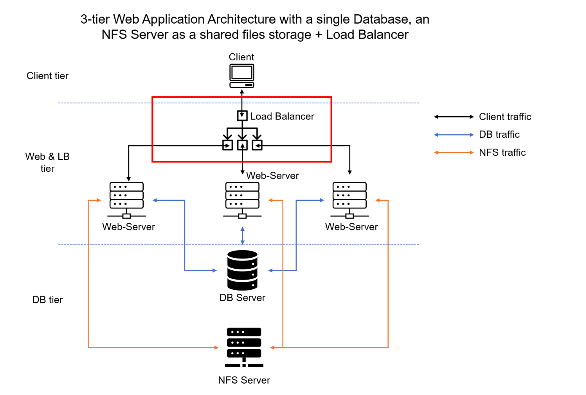

# LOAD-BALANCER-SOLUTION-WITH-APACHE

In this project I have enhanced my Tooling Website solution by adding a Load Balancer to disctribute traffic between Web Servers and allow users to access my website using a single URL.

I have deployed and configured an Apache Load Balancer for Tooling Website solution on a separate Ubuntu EC2 intance. I have also made sure that users can be served by Web servers through the Load Balancer.

