## Prerequisites 
I have the following servers installed and configured within project 7

1. Two RHEL8 Web Servers
2. One MySQL DB Server (based on Ubuntu 20.04)
3. One RHEL8 NFS server

**CONFIGURE APACHE AS A LOAD BALANCER**

Create an Ubuntu Server 20.04 EC2 instance and name it Project-8-apache-lb.
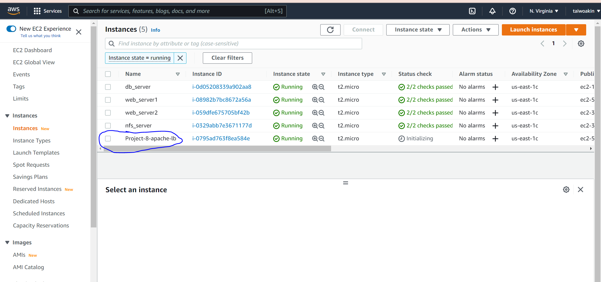

Open TCP port 80 on Project-8-apache-lb by creating an Inbound Rule in Security Group.
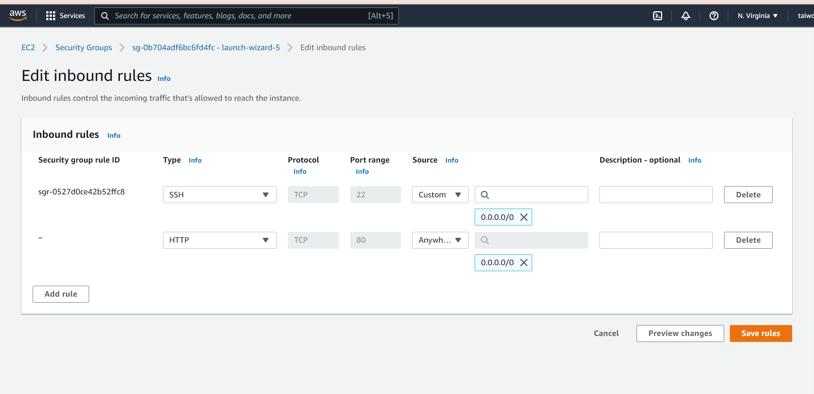

Install Apache Load Balancer on Project-8-apache-lb server and configure it to point traffic coming to LB to both Web Servers:

#Install apache2  
`sudo apt update`  
`sudo apt install apache2 -y`    
`sudo apt-get install libxml2-dev`

#Enable following modules:  
`sudo a2enmod rewrite`   
`sudo a2enmod proxy`  
`sudo a2enmod proxy_balancer`  
`sudo a2enmod proxy_http`  
`sudo a2enmod headers`  
`sudo a2enmod lbmethod_bytraffic`
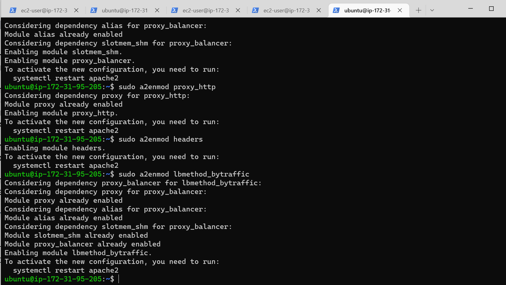

#Restart apache2 service  
`sudo systemctl restart apache2`
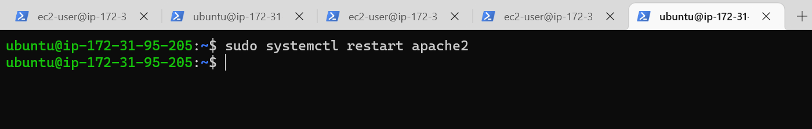

To check if apache2 is up and running.   
`sudo systemctl status apache2`
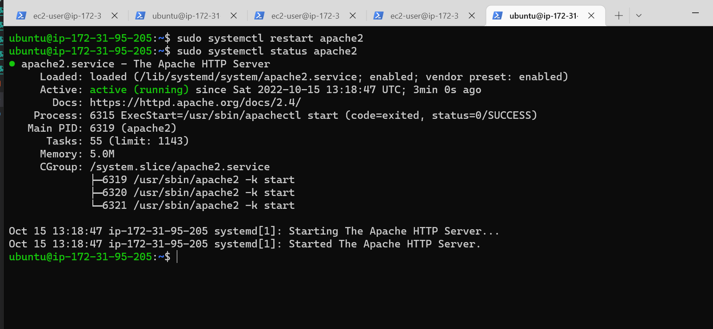

Configure load balancing - configuring the LB-Server enables it to efficiently manage the distribution of incoming traffic to the best available Web Server ( for this setup, traffic is distributed evenly - loadfactor=5)      

Edit the Apache configuration file to register the two web servers

`sudo vi /etc/apache2/sites-available/000-default.conf`

Add this configuration into the section <VirtualHost *:80> 

> <Proxy "balancer://mycluster">  
>        BalancerMember http://<WebServer1-Private-IP-Address>:80 loadfactor=5 timeout=1       
>        BalancerMember http://<WebServer2-Private-IP-Address>:80 loadfactor=5 timeout=1    
>        ProxySet lbmethod=bytraffic
>        # ProxySet lbmethod=byrequests   
>
>
> </Proxy>
>
>
>        ProxyPreserveHost On      
>        ProxyPass / balancer://mycluster/    
>        ProxyPassReverse / balancer://mycluster/    

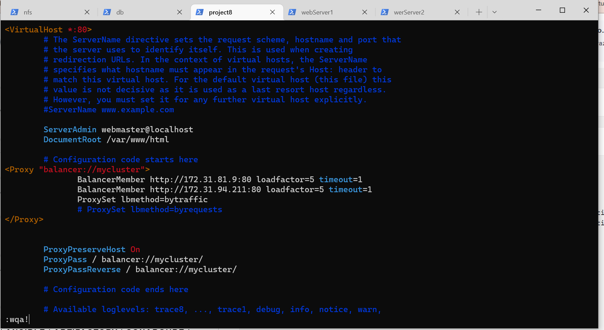

Restart the apache service to register the update and check the status of apache
`sudo systemctl restart apache2`    
`sudo systemctl status apache2`
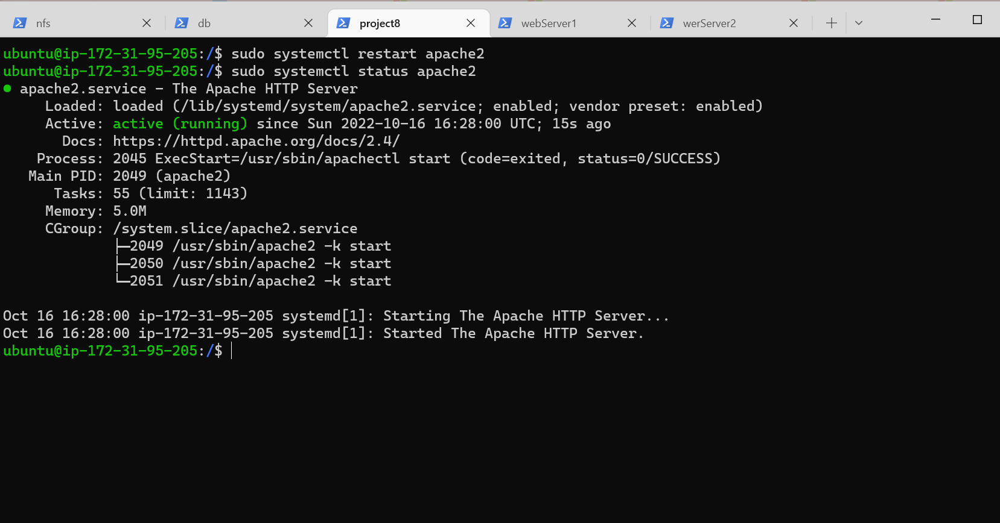

Verify the LB Server (via public ip) is serving the tooling website in the browser.
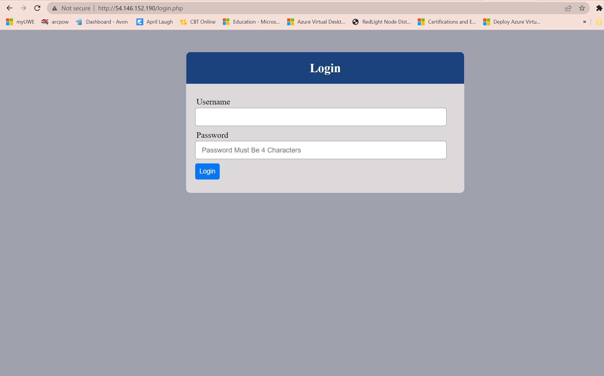

To unmount /var/log/httpd from both servers to the NFS server
`sudo umount -f /var/log/httpd/`
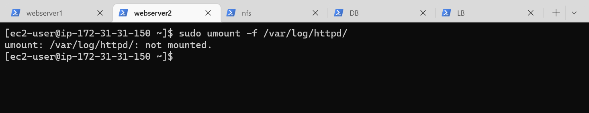

To see traffic distrubtion (Load balancing) in action - open log file for both web servers and refresh the LB-server serveral times.
`sudo tail -f /var/log/httpd/access_log`
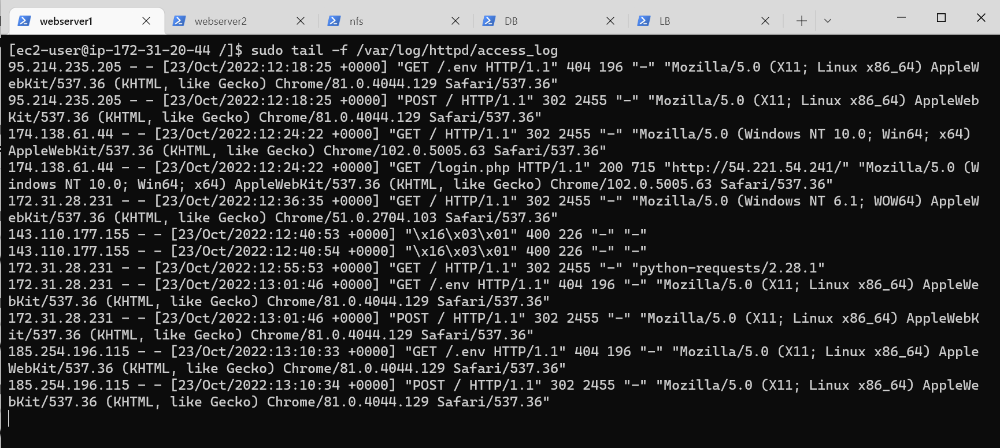

Optional Step – Configure Local DNS Names Resolution

Edit the file on LB server
`sudo vi /etc/hosts`
Add both web servers ip addresses 
172.31.20.44 Web1
172.31.31.150 Web2
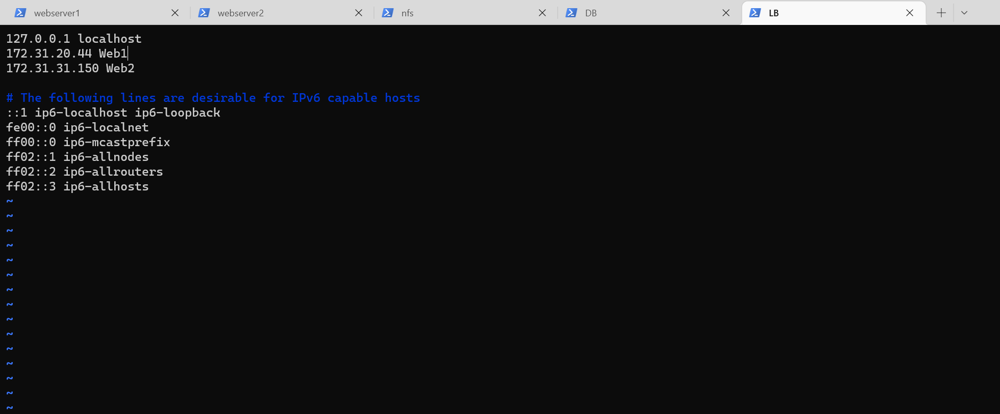

Now update the LB config file with those names instead of IP addresses.
`sudo vi /etc/apache2/sites-available/000-default.conf`
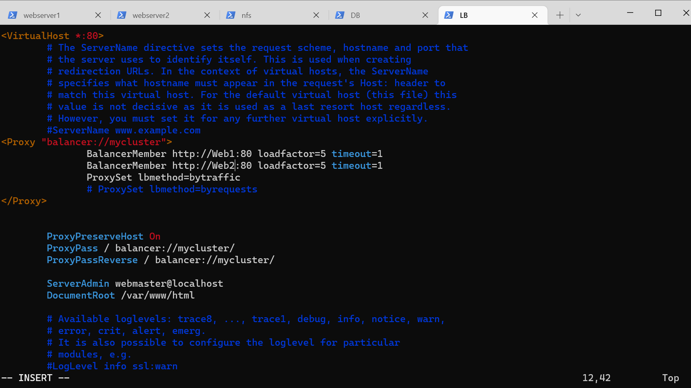

To curl the web servers from LB locally
`curl http://Web1` or `curl http://Web2`
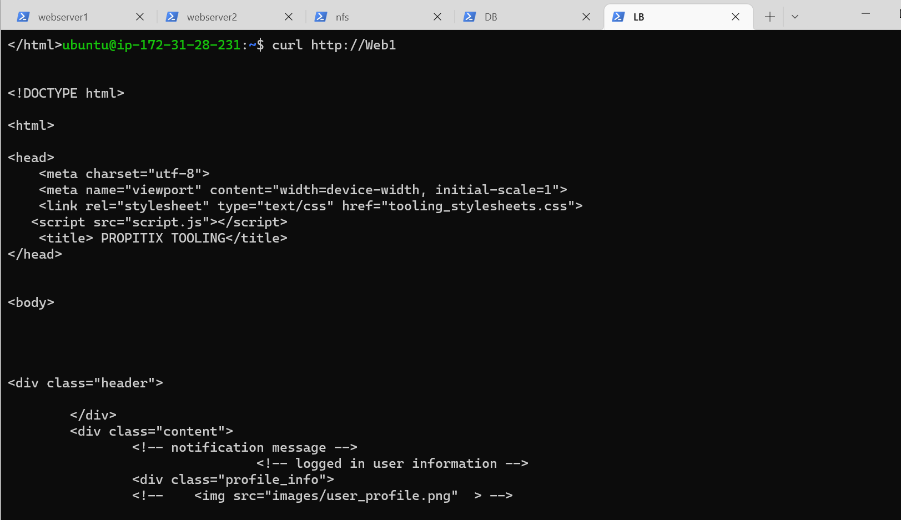

